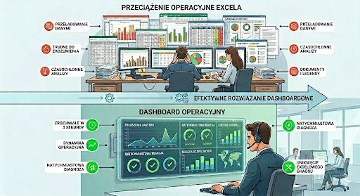

## Mistrzostwo CX

Sobotni wieczór. Miliony ludzi przed telewizorami wstrzymują oddech. Emocje sięgają zenitu, punkty spływają z całej Europy, a tabela wyników dynamicznie się zmienia.  

Patrzysz na eurowizyjny **scoreboard** i w ułamku sekundy wiesz wszystko: kto właśnie wskoczył na podium, kto zalicza spektakularny spadek, a kto ma już zwycięstwo w kieszeni. Bez instrukcji obsługi, bez legendy, bez szkolenia z analizy danych. 

To nie tylko rozrywka - to **mistrzostwo UX**.  

## Contact Center
  
A teraz zmieńmy scenę.

Poniedziałek rano, Contact Center w firmie energetycznej. Telefon zaczyna urywać się od zgłoszeń, na czacie rośnie kolejka, a w zespole operacyjnym zaczyna robić się gorąco.

Menedżer nie ma czasu na otwieranie trzech różnych systemów i przedzieranie się przez setki wierszy w Excelu. On potrzebuje swojego "eurowizyjnego scoreboardu". Chce wejść, spojrzeć i w 3 sekundy dostać jasną odpowiedź:

• Gdzie drastycznie rośnie kolejka?  
• Który proces właśnie utknął i generuje ruch?  

## Dashboard

Dane mają mówić, a nie tylko ładnie wyglądać.  
W biznesie, tak jak w punktacji na Eurowizji, liczy się natychmiastowa czytelność. Dobry dashboard operacyjny to nie tablica pełna skomplikowanych, przeładowanych wykresów, które wymagają doktoratu z analityki. To intuicyjne narzędzie do szybkiej nawigacji.  
  
Jeśli Twój zespół lub zarząd potrzebuje instrukcji, żeby zrozumieć raport, to czas go uprościć.  
  
A jak wygląda scoreboard w Twojej firmie? Informuje w 3 sekundy czy wymaga "głosowania jurorów", żeby wyciągnąć wnioski? 

Jeśli zainteresował Cię ten wpis, to wejdź w [link](https://www.linkedin.com/posts/marcinpendolski_obsagkugaklienta-energetyka-wizualizacjadanych-activity-7461478963736006657-uY4y?utm_source=share&utm_medium=member_desktop&rcm=ACoAACLNJl4BEVvx8Dyrv3vQKWalkk_oHr4oJEU) i skomentuj ten post na LinkedIn.