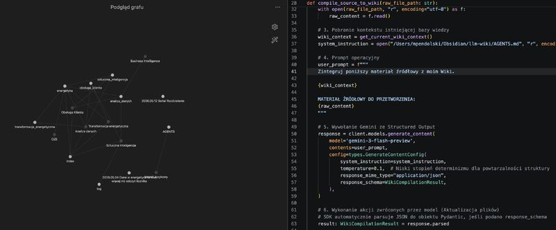

## RAG

Klasyczny **RAG** (Retrieval-Augmented Generation) przypomina menedżera, który przed każdym spotkaniem musi od nowa czytać te same raporty, aby przypomnieć sobie podstawowe fakty. Męczące, powtarzalne i mało efektywne.  
  
## Koncepcja Karpathy'ego

Zainspirowany koncepcją **Andreja Karpathy’ego** zacząłem budować prywatne **LLM Wiki** (oparte na Pythonie, Gemini i Obsidianie). Moim celem było zebranie praktycznych doświadczeń i sprawdzenie, czy możliwa jest budowa systemu, który uczy się raz, zamiast za każdym razem wracać do plików źródłowych.  
  
## Różnice
  
Największa różnica między podejściem Karpathy’ego a zwykłym RAG-iem?  
  
❌ **Zwykły RAG**: Za każdym razem przeczesuje setki stron od zera, żeby znaleźć odpowiedź na pytanie. Traci zasoby i czas na ponowne analizowanie tych samych danych.  
💡 **LLM Wiki**: Czyta materiał źródłowy tylko raz. Natychmiast destyluje z niego esencję, wyciąga wnioski i trwale przyswaja wiedzę.  

## Podsumowanie
  
Gdy do LLM Wiki dodaję raport, artykuł czy kod, system nie tworzy osobnej wyspy danych. Przechwytuje tę informację i natychmiast zderza ją z tym, co już wie. Robi kolejną iterację wiedzy: aktualizuje stare wnioski, nadpisuje nieaktualne dane i tworzy nowe połączenia.  
  
Zamiast chaotycznego archiwum plików buduję dynamiczny kapitał intelektualny, który rośnie i aktualizuje się sam z każdym nowym dokumentem.  

Jeśli zainteresował Cię ten wpis, to wejdź w [link](https://www.linkedin.com/posts/marcinpendolski_dataanalytics-ai-knowledgemanagement-activity-7470182602943987712-C57k?utm_source=share&utm_medium=member_desktop&rcm=ACoAACLNJl4BEVvx8Dyrv3vQKWalkk_oHr4oJEU) i skomentuj ten post na LinkedIn.