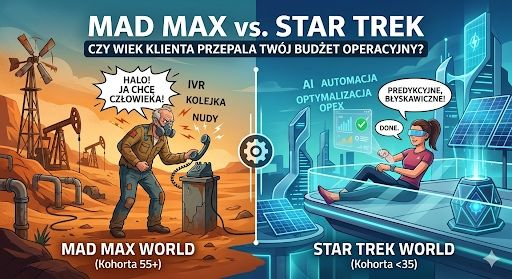

## Wiek Klienta

Mad Max vs. Star Trek: dlaczego wiek klienta pali Twój budżet operacyjny?  
  
Młodsze pokolenie nie chce rozmawiać z Twoim konsultantem. Starsze nie zamierza dyskutować z Twoim botem, potrzebuje kontaktu z człowiekiem.  
  
Projektowanie podróży klienta w branży energetycznej bez segmentacji demograficznej to jak próba siłowego połączenia dwóch różnych galaktyk:  
  
## Dwa Światy

**Świat Mad Maxa**: Klienci szukający prostych, sprawdzonych i "analogowych" rozwiązań, by po prostu szybko załatwić sprawę.  
  
**Świat Star Treka**: Cyfrowi nomadzi oczekujący bezobsługowego, futurystycznego interfejsu.  
  
Cyfrowa transformacja często zniekształca nam obraz. Zapominamy, że technologia ma ułatwiać życie, a nie budować mur między firmą a klientem.  
  
Co mówią twarde dane? Zamiast zgadywać, wrzuciliśmy na warsztat analitykę danych dla klientów indywidualnych. Przestaliśmy traktować bazę jako homogenną i podzieliliśmy ją na kohorty wiekowe.  
  
Efekt? Patrząc na dwie skrajne kohorty, to zamiast seryjnego wysyłania tych samych monitów do wszystkich, warto postawić na personalizację:  
  
**Kohorta 25-35 lat**: Automatyczny SMS z bezpośrednim linkiem do szybkich płatności. Wynik: wzrost ściągalności należności.  
  
**Kohorta 55+**: Tradycyjny, czytelny komunikat bezpośrednio na fakturze. Wynik: najwyższa responsywność i spadek kosztów windykacyjnych.  
  
## Segmentacja

Segmentacja behawioralno-demograficzna to nie luksus to czysta optymalizacja OPEX. Kluczem do sukcesu nie jest wdrożenie najnowszego bota dla każdego, ale precyzyjne dopasowanie kanału dotarcia tam, gdzie realnie przynosi on konwersję.  

