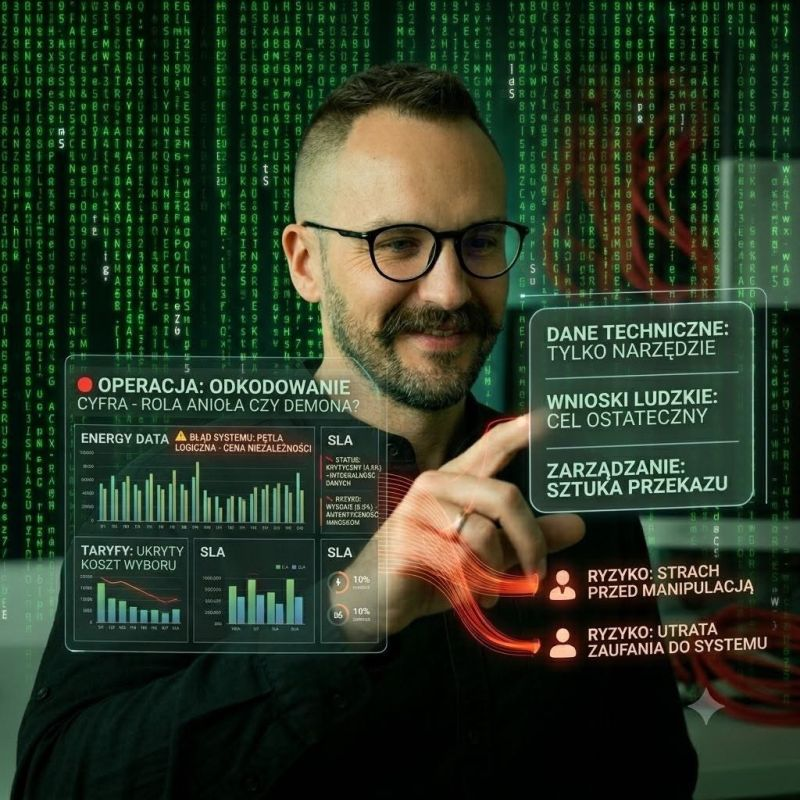

## Dane vs. wnioski

Dane są techniczne. Wnioski muszą być ludzkie.  
  
Pamiętacie Cyphera z **Matrixa**? Patrzył na spadające zielone znaki i mówił: „Nawet na to nie patrzę. Widzę tylko blondynkę, brunetkę, rudą...”.  
  
## Rola Analityka

W branży energetycznej, analizując dane z contact center łatwo utonąć w takim cyfrowym szumie. Widzimy piki zgłoszeń, czas obsługi i wskaźniki SLA.  
Ale biznes nie chce oglądać **Matrixa**. Chce wiedzieć, co dzieje się w realnym świecie.  
  
Rola analityka to rola tłumacza:  
  
Co mówią **dane techniczne**: „14% wzrost połączeń skorelowany z nową taryfą i niskim transferem w IVR”.  
  
Co mówi **ludzki wniosek**: „Klienci nie rozumieją nowych rachunków za prąd. Dzwonią, bo się boją, a automatyczna infolinia ich irytuje. Musimy uprościć komunikację i poprawić ścieżkę bota.”  
  
## Kluczowe wnioski
  
Dane to tylko **fundament**: Cyfry mówią co się dzieje, ale dopiero empatia i znajomość procesu tłumaczą dlaczego.  
  
**Storytelling** buduje wartość: Zarząd nie podejmuje decyzji na podstawie tabeli, ale na podstawie historii, którą te liczby opowiadają.  
  
**Człowiek ponad algorytmem**: Nawet najlepsze AI analityczne jest bezużyteczne, jeśli wniosek nie przekłada się na lepsze CX i prostszy język.

Dane są techniczne. Decyzje - zawsze ludzkie.  

Jeśli zainteresował Cię ten wpis, to wejdź w [link](https://www.linkedin.com/posts/marcinpendolski_datastorytelling-customerexperience-ai-activity-7463121548850294784-AfCj?utm_source=share&utm_medium=member_desktop&rcm=ACoAACLNJl4BEVvx8Dyrv3vQKWalkk_oHr4oJEU) i skomentuj ten post na LinkedIn.
