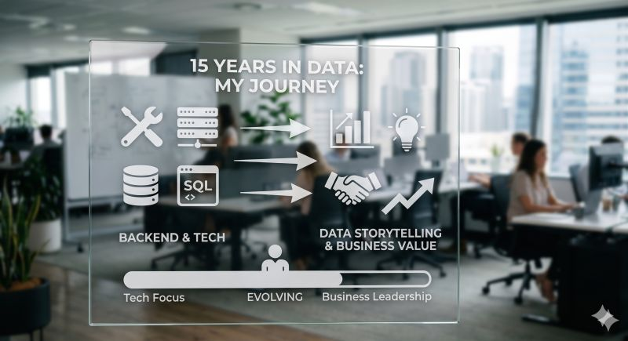

## Technologia

Moje przemyślenia po 15 latach pracy jako analityk danych.  
  
Przez większość kariery analizując dane dla obszaru obsługi klienta i contact center byłem przekonany, że moja praca zawsze leży na styku technologii i biznesu. W praktyce jednak skupiałem się głównie na procesach ETL i architekturze danych:  
  
• Dbaniu o maksymalną czystość i jakość danych.  
• Optymalizowaniu baz i szybkości ładowania raportów.  
• Dostarczaniu biznesowi twardych, niezawodnych fundamentów.  

## Storytelling
  
Storytelling i wizualizacja schodziły na dalszy plan. Wychodziłem z założenia, że dobrze przygotowane dane obronią się same, a to był błąd.  
  
Dziś wiem, że te proporcje należy odwrócić. Prawdziwy wpływ na organizację buduje się na tzw. ostatniej mili. To tam kluczowe staje się:  
  
• Skupienie na tym, co dane faktycznie mówią.  
• Data storytelling i przejrzysta, intuicyjna wizualizacja.  
• Przekładanie suchych liczb na język korzyści i decyzji biznesowych.  

## Wnioski
  
Świetne zaplecze techniczne to wciąż absolutna konieczność, ale to dopiero punkt wyjścia. Najlepsze dzieje się wtedy, gdy decyzje zapadają szybciej, bo raport mówi prostym, ludzkim językiem.  
  
Wychodzę z założenia, że każda kolejna analiza i każdy kolejny krok w tę stronę przyniesie wartość dodaną w mojej pracy i realny zysk dla biznesu.  

