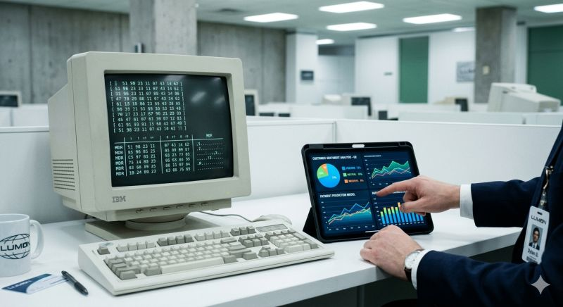
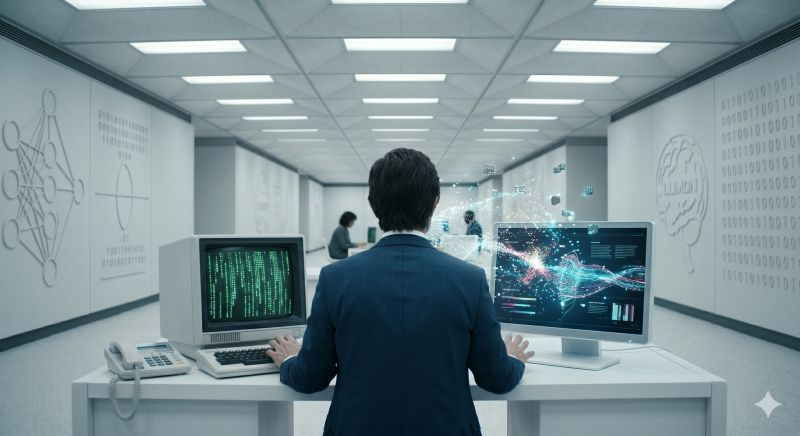

## Lumon

Serial **„Rozdzielenie”** trwałby jeden odcinek, gdyby Lumon wdrożyło AI.  
  
W serialu pracownicy spędzają lata na ręcznym wyłapywaniu cyferek. W branży energetycznej mamy podobne wyzwanie: miliony odczytów i interakcji w Contact Center, które bez odpowiedniej analityki są tylko szumem.  

## AI

Z perspektywy analityka danych, AI to koniec „ery rozdzielenia”:  

• **Zamiast domysłów są fakty**: Algorytmy klasyfikują powody zgłoszeń klientów w czasie rzeczywistym. Coś, co w tradycyjnym modelu zajmuje zespołom tygodnie, AI robi w sekundy.  
• **Predykcja zamiast reakcji**: Zamiast gasić pożary, przewidujemy, który klient może mieć problem z płatnością, zanim w ogóle do nas zadzwoni.  
  
W świecie AI postacie z serialu nie miałyby co robić. I to jest najlepsza wiadomość, ponieważ technologia uwalnia nas od bycia organicznymi procesorami, pozwalając skupić się na strategii i wnioskach.  

## Procesy
  
A Wy? Widzicie w swoich firmach procesy, które AI mogłoby skrócić z "całego sezonu" do jednego odcinka?  

Jeśli zainteresował Cię ten wpis, to wejdź w [link](https://www.linkedin.com/posts/marcinpendolski_energysector-dataanalytics-customerexperience-activity-7459852422547542016-sS1S?utm_source=share&utm_medium=member_desktop&rcm=ACoAACLNJl4BEVvx8Dyrv3vQKWalkk_oHr4oJEU) i skomentuj ten post na LinkedIn.
