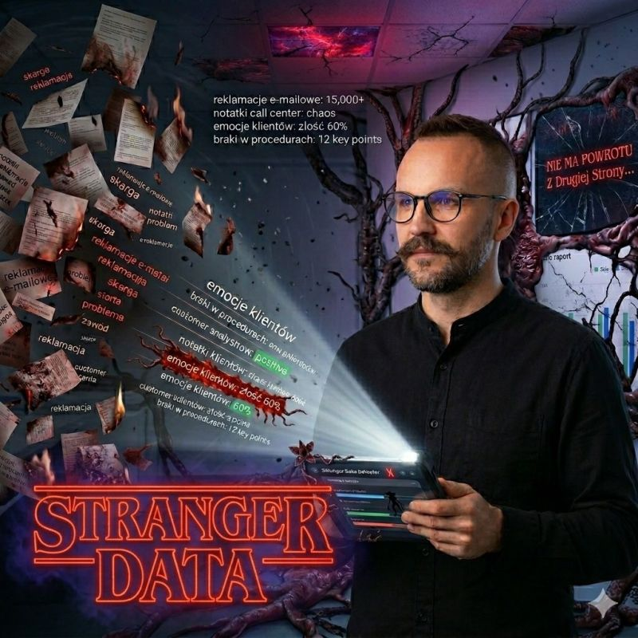

## Wskaźniki KPI

Znasz ten moment? Patrzysz na dashboard: **wskaźniki KPI** świecą na zielono, SLA dowiezione, wykresy wyglądają perfekcyjnie. Nasza znajoma, bezpieczna rzeczywistość podpowiada: "Wszystko działa jak w zegarku".  
  
## Upside Down

A jednak... proces wciąż gdzieś przecieka.  
Dzieje się tak, bo pod powierzchnią tych idealnych tabel istnieje **„Druga Strona” (Upside Down)** - mroczny świat nieustrukturyzowanych danych: tysiące e-maili, czatów i chaotycznych notatek z call center.  
  
To właśnie tam ukryte są powody, dla których procesy zawodzą:  
• **Luki w procedurach**, których nie wykaże żaden prosty raport sprzedaży.  
• **Emocje klientów**, których nie odda suchy kod błędu w systemie.  

## AI

Szacuje się, że nawet 80% kluczowych informacji o doświadczeniach klienta to po prostu tekst. Jako analitycy nie możemy ignorować tej przestrzeni. Wykorzystanie AI do **analizy sentymentu** to nie „gadżet”. To nasza latarka, która pozwala wejść na **„Drugą Stronę”**, przetłumaczyć chaos na twarde wnioski i realnie naprawić biznes.  

