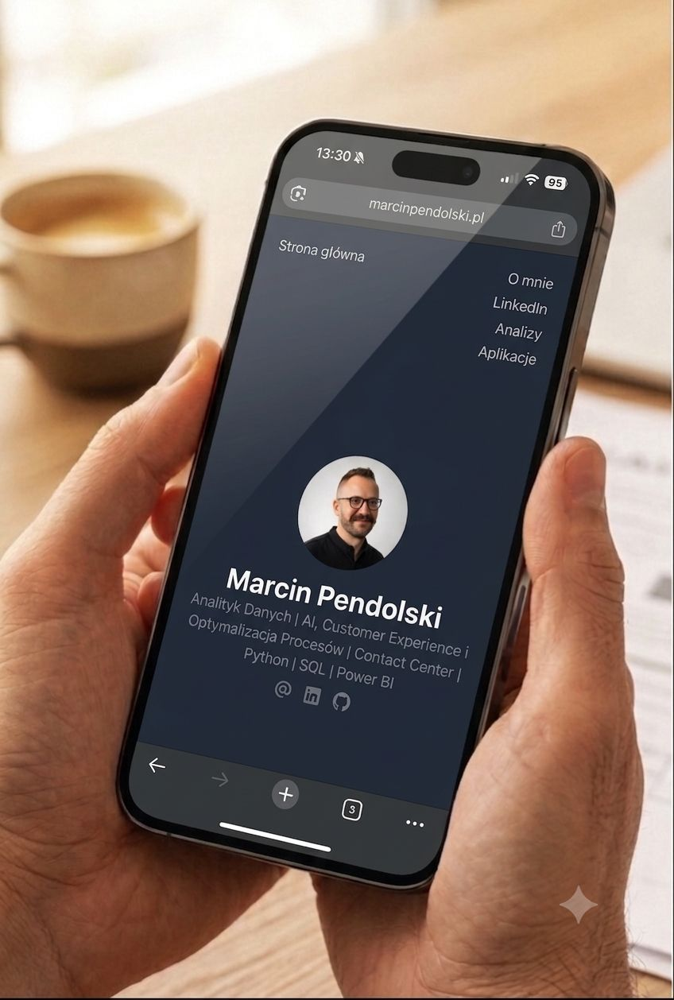

## Pomysł

Uruchomiłem stronę marcinpendolski.pl

Chcę mieć jedno miejsce na zbieranie swoich przemyśleń i wniosków z pracy oraz dodatkowych projektów, które realizuje.

## Wykonanie

Zamiast WordPressa, wybrałem Hugo z motywem Congo i hosting bezpośrednio na GitHub Pages.

O ile samo wygenerowanie strony z Hugo poszło sprawnie, o tyle podpięcie pod własną domenę i konfiguracja routingu DNS już nie.

Trochę walczyłem z rekordami A, CNAME i odświeżaniem stref DNS dla GitHub Pages. Ostatecznie skorzystałem z AI w roli szybkiego konsultanta oraz klasycznego supportu.

## Zaproszenie

Jeśli masz ochotę zobaczyć pierwsze efekty (i śledzić, jak z czasem będzie przybywać tam nowych treści), zajrzyj bezpośrednio tutaj: marcinpendolski.pl

Jeśli zainteresował Cię ten wpis, to wejdź w [link](https://www.linkedin.com/posts/marcinpendolski_hugo-githubpages-share-7479510711531122688-FYNG/?utm_source=share&utm_medium=member_desktop&rcm=ACoAACLNJl4BEVvx8Dyrv3vQKWalkk_oHr4oJEU) i skomentuj ten post na LinkedIn.
